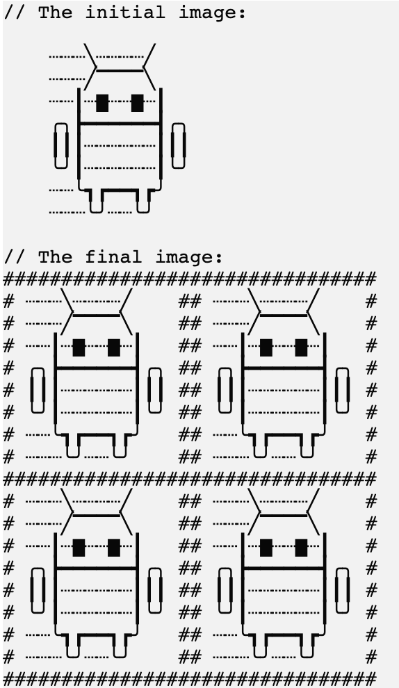
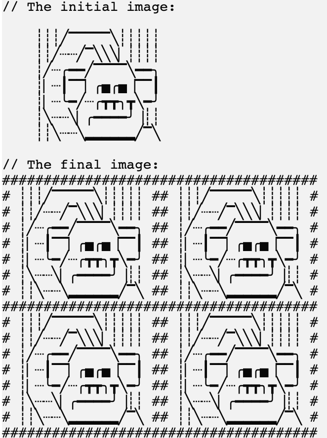

### Theory

You already know enough about Kotlin to solve this task! 
So let's get straight to the point.

___

### Task

**Description**: implement the `applySquaredFilter` function.
For the border symbol, please use the pre-defined variable `borderSymbol`.

To make the picture prettier, add a separator between the picture and the border.
For the separator, please use the pre-defined variable `separator`.
Note that the picture might not be a square, which means the width of different lines in the picture can be different.
In other words, you need to pad the shorter lines with the `separator` to the length to make the image square.

In addition, the project already stores the `newLineSymbol` variable, which can be used to split the picture into lines.

Here's an example of the function's work:

    

If you have any difficulties, **hints will help you solve this task**.

----

### Hints

First example:

Second example:

   You can use the <code>applyBordersFilter</code> function to add the borders, next 
   create two <code>StringBuilder</code>s (one for the top and one for the bottom part), 
   and put them row by row.

   To check how your function works, you can run it in <code>main</code> by passing the pre-defined variable <code>simba</code>.

