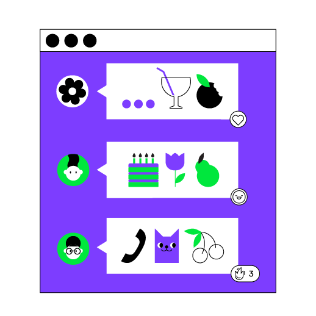

# Task: 1/1: Create a "chat" application

This lesson focuses on the topics that you covered in the previous lesson. 
The main difference is that the final project will not be divided into intermediate stages 
and you can try to implement it yourself from scratch. 
We have no doubt that you will succeed!

----

<p align="center">
    
</p>

The project of this lesson is **Chat**.
The purpose of this game is to ask questions to the user to get to know them better.

Write a console application 
that will communicate with the user in an interactive dialogue format:

```text
- Hello! I'm glad to meet you, let me get to know you better! What is your name?
- <some user's answer>
- Nice to meet you, <some user's answer>! My name is Kotlin Bot! I am a young programming language created in 2010. How old are you?
- <some user's answer>
- <some user's age> is great! I hope you successfully complete this course! Anyone can learn programming at any age!
```

An example of the final application:


If you have any difficulties, **hints will help you solve this task**.

----

### Hints

<div class="hint" title="The built-in print function">
Besides `println`, Kotlin has another similar function – [`print`](https://kotlinlang.org/api/latest/jvm/stdlib/kotlin.io/print.html#print).
Its only difference from `println` is that it does not wrap text to a new line.
Thus, if we replace the `println` function from the previous example 
with the `print` function, we get the following result:

```kotlin
print("One")
print("Two")
```
The output is:
```text
OneTwo
```
</div>

<div class="hint" title="String templates">

String literals may contain template expressions – pieces of code that are
evaluated and whose results are concatenated into the string.
[A template expression](https://kotlinlang.org/docs/strings.html#string-templates) starts with a dollar sign (`$`) and consists of either a name or an expression in curly braces.

To insert something into a string, you can use the following construction:
```kotlin
val a = 5
println("a = $a") // a = 5 will be printed
```
</div>
