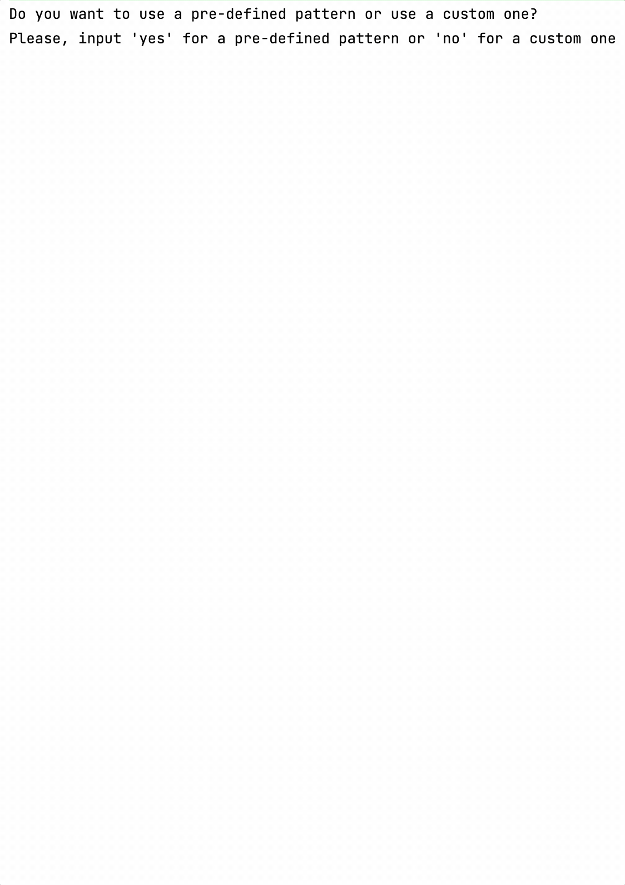

On this step you need to finish the app.

<div class="hint" title="The patterns generator example">

  

</div>

The tests of this step will be aimed at checking the following _two_ functions:
- `applyGenerator`, which accepts the `pattern`, `generatorName`, `width`, and `height` that were inputted by the user.
  This function should call the necessary generator to return a generated picture.
- `getPattern`, which asks if the user wants to choose a pre-defined pattern or input a custom one.

Also, the `main` function will be checked for correctness. The `main` function should ask user about pattern, generator, width, and height, 
and next print the initial pattern and the generated image (like on the gif above).

In this project, you can use the already implemented functions and variables:

- the `getPatternByName` function, which accepts a pattern name and returns the pattern if it exists or `null` otherwise;
- the `allPatterns` function, which returns the names of all pre-defined patterns.

If you have any difficulties, **hints will help you solve this task**.

----

### Hints

<div class="hint" title="The `toInt` built-in function">

To convert the user input into <code>Int</code> (to get width and height),
you can use the <a href="https://kotlinlang.org/api/latest/jvm/stdlib/kotlin.text/to-int.html"><code>toInt</code></a> function, e.g.:
  ```kotlin
  val width = safeReadLine().toInt()
  ```
You can also use <a href="https://kotlinlang.org/api/latest/jvm/stdlib/kotlin.text/to-int-or-null.html"><code>toIntOrNull</code></a> to parse it more safely, e.g.:
  ```kotlin
    val width = safeReadLine().toIntOrNull() ?: error("Incorrect number!")
  ```
</div>


<div class="hint" title="Best practices to handle the user input">
  Don't forget to handle input errors in the <code>getPattern</code> function 
  as well as in the user-entered name of the generator (<code>canvas</code> or <code>canvasGaps</code>). 
  The program should not crash on invalid input but rather inform the user of the error and ask them 
  to try again.
</div>