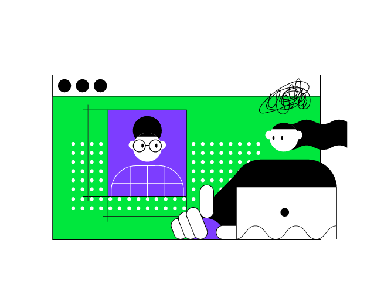

Hello! This lesson focuses on the topics that you covered in the previous lesson.
The main difference is that the final project will not be divided into intermediate stages
and you can try to implement it yourself from scratch.
We have no doubt that you will succeed!

----

<p align="center">
    
</p>

### Project description

The project of this lesson is **Patterns generator**.
The purpose of this project is to create an application 
for automatically generating character images of a given size and pattern.

Firstly, you need to ask the user:
```text
Do you want to use a pre-defined pattern or a custom one?
Please input 'yes' for a pre-defined pattern or 'no' for a custom one.
```

You need to handle the user's answer and ask the question again if the answer is incorrect.
If the user wants to use a custom pattern, you just need to ask them to input it.
If the user wants to use a pre-defined pattern, 
you need to ask them to choose one of the pre-defined patterns. 
You can get a list with all of them by calling the already defined `allPatterns` function.

Secondly, you need to ask the user to choose the generator: `canvas` or `canvasGaps`.
And finally, ask the user to input the `width` and `height` of the generated picture.

### Project example


In order for the picture to fit, additional line breaks were added.
You don't need to add them when solving the task.

If you have any difficulties, **hints will help you solve this task**.

----

### Hints and detailed descriptions

The `canvas` generator should build a rectangle `width` x `height` from the pattern.
The generator works according to the following algorithm:
1) The **first** level of the generated image does **not change** the pattern;
2) Each subsequent level in the generated image removes the top line from the pattern,
   but only if the pattern has more than one line;
3) When repeated **vertically**, the pattern remains **unchanged**.

<div class="hint" title="The `canvas` filter examples">
  For example, consider the following pattern:

```text
 X
/ \
\ /
 X
```

The resulting 5 x 3 picture will be:

```text
            CORRECT:             INCORRECT:

            X  X  X  X  X         X  X  X  X  X 
1st level: / \/ \/ \/ \/ \       / \/ \/ \/ \/ \
           \ /\ /\ /\ /\ /       \ /\ /\ /\ /\ /
            X  X  X  X  X         X  X  X  X  X 
2nd level: / \/ \/ \/ \/ \        X  X  X  X  X
           \ /\ /\ /\ /\ /       / \/ \/ \/ \/ \
            X  X  X  X  X        \ /\ /\ /\ /\ / 
3rd level: / \/ \/ \/ \/ \        X  X  X  X  X 
           \ /\ /\ /\ /\ /        X  X  X  X  X 
            X  X  X  X  X        / \/ \/ \/ \/ \ 
                                 \ /\ /\ /\ /\ / 
                                  X  X  X  X  X
```

The first line of the initial pattern was removed from the second and further levels.
The wrong example shows image generation without removing the top line in the second and third levels.

However, if the size is 5 x 1, the resulting picture will be:

```text
            CORRECT:             INCORRECT:
 
            X  X  X  X  X         X  X  X  X  X
1st level: / \/ \/ \/ \/ \       / \/ \/ \/ \/ \
           \ /\ /\ /\ /\ /       \ /\ /\ /\ /\ /
            X  X  X  X  X 
```

In this case, we kept the first line because, according to the first point of the algorithm, 
we don't need to change the first level of the generated picture.
</div>

The `canvasGaps` generator should build a rectangle `width` x `height` from the pattern,
while leaving gaps instead of every other element.
The generator works according to the following algorithm:
1) **None of the levels** of the generated image **change** the pattern;
2) The gap is a rectangle of spaces, the dimensions
   of which are equal to the width and height of the initial pattern;
3) In every **odd level**, the gap should be in **even** positions,
   and in every **even level** - in **odd**;
4) When repeated **vertically**, the pattern remains **unchanged**.

<div class="hint" title="The `canvasGaps` filter examples">
  For example, let's take the pattern:

```text
 X
/ \
\ /
 X
```

The resulting 5 x 3 picture will be:

```text
            CORRECT:             INCORRECT: 
            
            X     X     X         X     X     X 
1st level: / \   / \   / \       / \   / \   / \
           \ /   \ /   \ /       \ /   \ /   \ /
            X     X     X         X     X     X
               X     X              / \   / \
2nd level:    / \   / \             \ /   \ /    
              \ /   \ /              X     X
               X     X           / \   / \   / \
            X     X     X        \ /   \ /   \ /    
3rd level: / \   / \   / \        X     X     X 
           \ /   \ /   \ /
            X     X     X 
```

None of the levels of the generated image change the pattern.
</div>

In this project, you can use the already implemented functions and variables:
- the `separator` variable, which stores a space;

- the `newLineSymbol` variable, which stores a new line symbol;
- the `getPatternWidth` function, which accepts a pattern and calculates its width;
- the `getPatternByName` function, which accepts a pattern name and returns the pattern if it exists or `null` otherwise;
- the `allPatterns` function, which returns the names of all pre-defined patterns.

The tests of the tasks will be aimed at checking the following _six_ functions:
- `fillPatternRow`, which accepts a `patternRow` (one line from the pattern) and `patternWidth`
and adds the row `separator` to extend the line to the `patternWidth` size.

- `getPatternHeight`, which accepts a `pattern` and calculates its height.
- `canvasGenerator`, which accepts the `pattern`, `width`, and `height` that were inputted by the user. 
This function should return a new string with a generated canvas picture.
- `canvasWithGapsGenerator`, which accepts the `pattern`, `width`, and `height` that were inputted by the user.
This function should return a new string with a generated canvas-with-gaps picture.
- `applyGenerator`, which accepts the `pattern`, `generatorName`, `width`, and `height` that were inputted by the user.
This function should call the necessary generator to return a generated picture.
- `getPattern`, which asks if the user wants to choose a pre-defined pattern or input a custom one.

Also, the `main` function will be checked for correctness.

The following functions will _not be checked_, but they can help you implement this project:
- `dropTopFromLine`, which accepts a line (any string, can be multi-row) and deletes the first line,
  e.g.:
```text
   .+------+                 
 .' |    .'|                .' |    .'|
+---+--+'  |    ----->     +---+--+'  |
|   |  |   |               |   |  |   |
|  ,+--+---+               |  ,+--+---+
|.'    | .'                |.'    | .' 
+------+'                  +------+'
```

- `repeatHorizontally`, which accepts a `pattern` and the number of times it should be repeated horizontally (n), e.g.:
```text
n = 5
○○             ○○○○○○○○○○
○○    ---->    ○○○○○○○○○○
```

- `repeatHorizontallyWithGaps`, which accepts a `pattern` and the number of times it should be repeated horizontally (n), e.g.:
```text
n = 5
○○             ○○  ○○  ○○
○○    ---->    ○○  ○○  ○○
```


<div class="hint" title="The `toInt` built-in function">

  To convert the user input into <code>Int</code> (to get width and height), 
  you can use the <a href="https://kotlinlang.org/api/latest/jvm/stdlib/kotlin.text/to-int.html"><code>toInt</code></a> function, e.g.:
  ```kotlin
  val width = safeReadLine().toInt()
  ```
  You can also use <a href="https://kotlinlang.org/api/latest/jvm/stdlib/kotlin.text/to-int-or-null.html"><code>toIntOrNull</code></a> to parse it more safely, e.g.:
  ```kotlin
    val width = safeReadLine().toIntOrNull() ?: error("Incorrect number!")
  ```
</div>

<div class="hint" title="The `dropLast` built-in function">

  To drop <code>n</code> last symbols from a <code>String</code>, you can use the <a href="https://kotlinlang.org/api/latest/jvm/stdlib/kotlin.text/drop-last.html"><code>dropLast</code></a> function, e.g.:
  ```kotlin
  val a = "MyText"
  println(a.dropLast(3)) // MyT
  ```
  If you need to drop <code>n</code> symbols from the beginning of a <code>String</code>, you can use the <a href="https://kotlinlang.org/api/latest/jvm/stdlib/kotlin.text/drop.html"><code>drop</code></a> function.
</div>

<div class="hint" title="The `repeat` built-in function">

  To generate a string that consists of some repeated symbols, you can use the <a href="https://kotlinlang.org/api/latest/jvm/stdlib/kotlin.text/repeat.html"><code>repeat</code></a> function, e.g.:
  ```kotlin
  println("a".repeat(5)) // aaaaa
  ```
</div>


<div class="hint" title="The main idea of `fillPatternRow` function">
  To implement the <code>fillPatternRow</code> function, you just need to check 
  if the length of the current pattern row is less than the pattern width. 
  If it is true, add the necessary number of spaces at the end of the row.
</div>

<div class="hint" title="The pattern height calculation">
  The pattern height can be calculated as the number of rows in the pattern.
</div>

<div class="hint" title="Code style hint">
  In industrial programming, duplicate code is commonly avoided and put into functions. 
  However, it is not always possible to immediately write clear and readable code. 
  Try implementing the <code>canvasGenerator</code> and <code>canvasWithGapsGenerator</code> functions 
  so that they pass all the tests and then start improving the code. 
  This process is called <i>refactoring</i>.
</div>

<div class="hint" title="Best practices to handle the user input">
  Don't forget to handle input errors in the <code>getPattern</code> function 
  as well as in the user-entered name of the generator (<code>canvas</code> or <code>canvasGaps</code>). 
  The program should not crash on invalid input but rather inform the user of the error and ask them 
  to try again.
</div>
