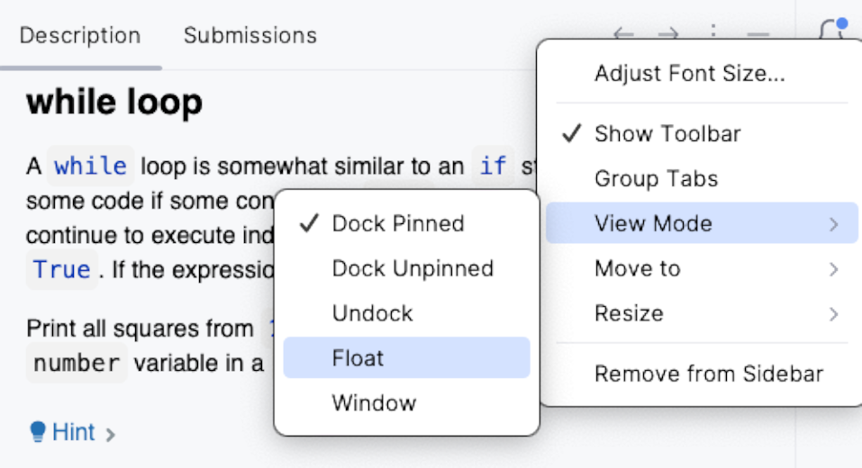

## Task Description

The **Task Description** window provides all the information required to complete a task:

- Theoretical tasks: Offers learning and reading materials.
- Quizzes: Presents multiple-choice questions.
- Programming assignments: Describes the problem to be solved.

Use the Task Description icons for the following actions:

| Icon                                                        | Description                                                                                                          |
|-------------------------------------------------------------|----------------------------------------------------------------------------------------------------------------------|
| **Check**                                                   | Validate your quiz answer or your code solution for a programming task |
|  &nbsp;or **Next** | Go to the next task                                                                           | 
|                                        | Discard all changes you made in the task and start over                               | 
|                                  | Leave feedback about Jetbrains Academy                                                        | 
| **Get Hint**                                                  | Receive an AI-generated hint                                                                                   |

We recommend keeping the Task Description window visible while you work. If it is too distracting, you can collapse it by clicking the  button in the top right-hand corner.

If you use two monitors, consider switching the Task Description panel to floating mode and moving it to the second screen, or just placing it near the main IDE window. To do this, click the tool window settings  /  icon :

