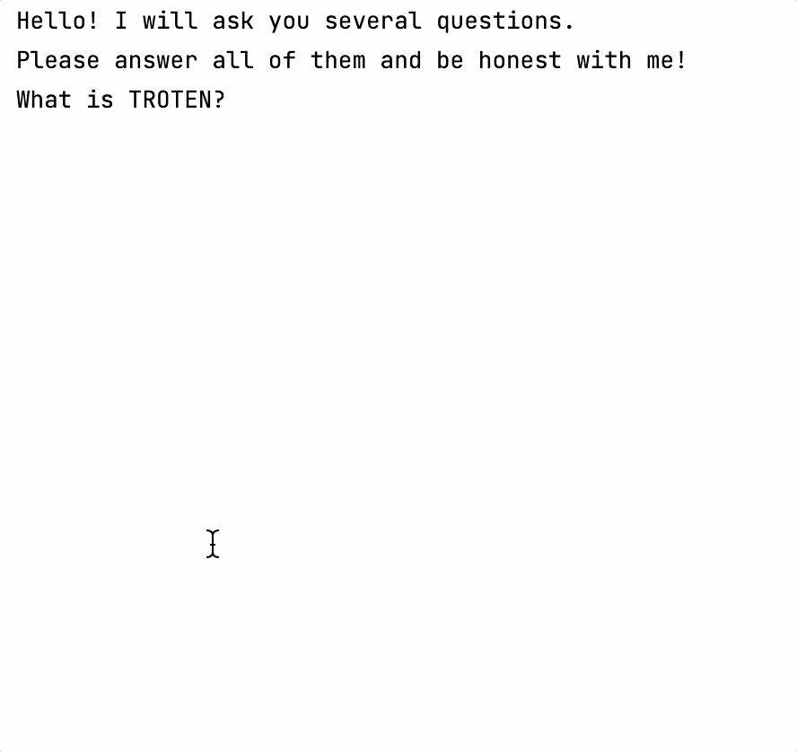

### Theory

Congratulations, you've almost finished your first project! 

<div class="hint" title="Extra theory">

I'll tell you a little trick on how you can write [comments](https://kotlinlang.org/docs/basic-syntax.html#comments)
for other developers (or for yourself) in your code.
To do this, use a double slash at the beginning of the code line:
```kotlin
fun main() {
    // My comment, I can write whatever I want here
}
```
Comments are usually left for the most difficult parts of the code.
They make it easier to later understand what the code is doing.

</div>
___

### Task

**Description**: Print the real questions and the user's answers to them. 
The real questions are stored in the already predefined `firstQuestion`, `secondQuestion`, and `thirdQuestion` variables.

Before the real questions, print the text: 'Now let's have fun!'

<div class="hint" title="Game's example">

The game should look like this:



</div>
