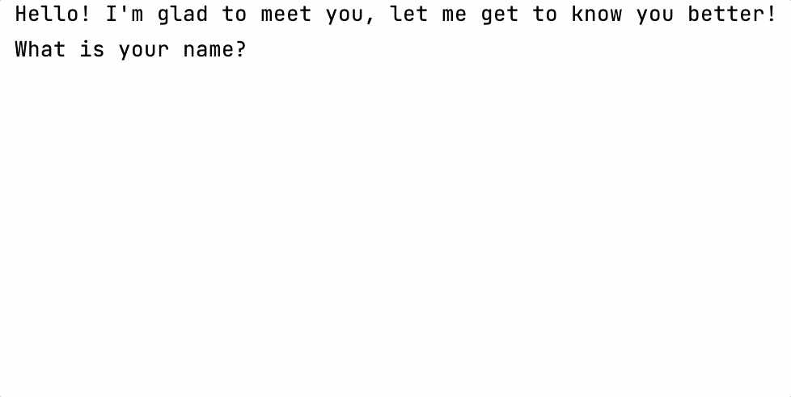

Hello! This lesson focuses on the topics that you covered in the previous lesson. 
The main difference is that the final project will not be divided into intermediate stages 
and you can try to implement it yourself from scratch. 
We have no doubt that you will succeed!

----

The project of this lesson is **Bot for dating**.
The purpose of this game is to ask questions to the user to get to know them better.

Write a console application 
that will communicate with the user in an interactive dialogue format:

```text
- Hello! I'm glad to meet you, let me get to know you better! What is your name?
- <some user's answer>
- Nice to meet you, <some user's answer>! My name is Kotlin Bot! I am a young programming language created in 2010. How old are you?
- <some user's answer>
- <some user's age> is great! I hope you successfully complete this course! Anyone can learn programming at any age!
```

An example of the final application:



In order for the picture to fit, additional line breaks were added. 
You don't need to add them when solving the task.
