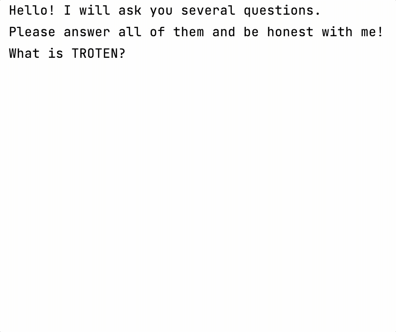

Hello! Welcome to the CSC Kotlin course. 
This block of the course is designed for beginners
and focuses on the basic concepts of the Kotlin language. 

Each lesson of the course is built in the form of a project: 
step by step, by completing different small tasks, 
you will get a finished small project in the end.
At the end of each lesson, an additional similar project will be offered: 
it includes all the topics of the lesson but is not divided into small tasks.

All topics will be accompanied by links to [the official Kotlin documentation](https://kotlinlang.org/docs/home.html), 
which you can read later.

----

The project of this lesson is **Poetry generator**.
The goal of this game is to ask the user several fun questions,
remember the answers, and build a fun story from these answers.

The lesson includes the following topics:

- the entry point for a Kotlin program;
- built-in functions for printing to console;
- variables;
- built-in functions for reading user input.

An example of this game:

