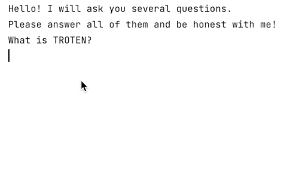

### Theory

We have previously talked about the _built-in_ functions in Kotlin. 
In addition to the already familiar functions for output to the console, 
Kotlin has the [`readLine`](https://kotlinlang.org/api/latest/jvm/stdlib/kotlin.io/read-line.html#readline) function,  
which reads the values entered by the user and stores them in a variable.

For example, in our **Poetry generator** project, 
we need to ask the user a question and then remember their answer. 
That is exactly what the `readLine` function is for. 
The function tells the program to stop and wait for 
the user to enter some value into the console; then it allows the program  
to receive the value and, for example, write it into a variable.

`String` values can contain the values of _other_ variables.
For example, to print some text with a value to the console, [the string templates](https://kotlinlang.org/docs/basic-types.html#string-templates) can be used:
```kotlin
val firstAnswer = "my text"
println("The value: $firstAnswer")
```
The printed text will be: `The value: my text`.
In other words, the value from the `firstAnswer` variable will be inserted into the string.

In the above example, the `firstAnswer` variable must be declared **before** it is used with `$`.
___

### Task

**Description**: ask the user three questions and add the answers 
to _firstUserAnswer_, _secondUserAnswer_, and _thirdUserAnswer_ variables respectively.
The questions are:

(1) What is TROTEN?

(2) How did you spend your graduation?

(3) Why does a spider need eight legs?

<div class="hint">

In the result, the user's interaction with the game will look like this:



</div>
