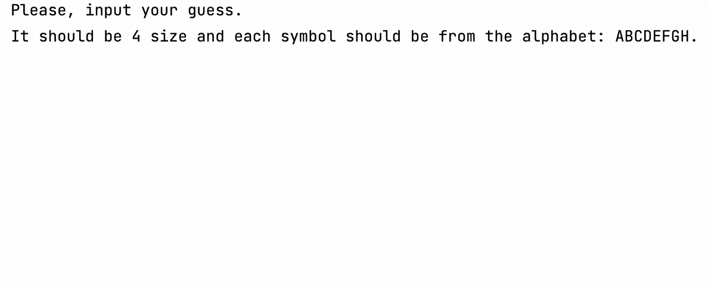

### Theory

Well, it looks like the game is ready! But what else is left to do?

When writing programs, it is essential to consider _possible_ behaviour 
scenarios and process them. For example, in the current version of the game, 
the user may enter a word that does not match the current game parameters 
(alphabet, word length, and so on), and if so, it is necessary to process 
the case and inform the user about the problem.

As we already know, Kotlin has many built-in functions. 
If you need to check some list (or string) for emptiness, 
you can use the [`isEmpty`](https://kotlinlang.org/api/latest/jvm/stdlib/kotlin.collections/is-empty.html) and [`isNotEmpty`](https://kotlinlang.org/api/latest/jvm/stdlib/kotlin.collections/is-not-empty.html) built-in functions:
```kotlin
if (someString.length == 0) {
    TODO("Not implemented yet")
}
```
It is the same as: 
```kotlin
if (someString.isEmpty()) {
    TODO("Not implemented yet")
}
```
Another example: 
```kotlin
if (someString.length != 0) {
    TODO("Not implemented yet")
}
```
It is the same as:
```kotlin
if (someString.isNotEmpty()) {
    TODO("Not implemented yet")
}
```

As mentioned earlier, in Kotlin we can use complex conditions with multiple branches. 
However, if the conditional is used inside a function with `return`, 
the `else` word can be omitted:
```kotlin
fun myFunction(a: Int): String {
    if (a > 0) {
        return "Positive"
    } else if (a == 0) {
        return "Zero"
    } else {
        return "Negative"
    }
}
```
It is equal to:
```kotlin
fun myFunction(a: Int): String {
    if (a > 0) {
        return "Positive"
    }
    if (a == 0) {
        return "Zero"
    }
    return "Negative"
}
```
___

### Task

**Description**: implement the `safeUserInput` function, which accepts `wordLength` and `alphabet`
and handles incorrect user input:

- before reading the user input, print the requirements: 

```text
Please input your guess. It should be <wordLength> characters long, and all symbols should be <alphabet> alphabet characters.
```
- to read the line of user input, use the `safeReadLine` function as earlier (or your own implementation of it);
- to check the correctness of the user's input, implement the `isCorrectInput` function, 
which accepts `userInput`, `wordLength`, and `alphabet` and returns `true` if the input is correct and `false` otherwise. 
This function should have the following behaviour:
  - inform the user if the length of the input is incorrect:
    ```text
    The length of your guess should be <wordLength> characters! Try again!
    ```
  - inform the user if the input contains wrong symbols:
  ```text
    All symbols in your guess should be <alphabet> alphabet characters! Try again!
    ```
- use these functions in the game process.

Here's an example of the `safeUserInput` function's work:



In order for the picture to fit, additional line breaks were added.
You don't need to add them when solving the task.

<div class="hint">
  To check if all symbols in the user's input are correct, you 
  can use the <a href="https://kotlinlang.org/api/latest/jvm/stdlib/kotlin.collections/filter.html"><code>filter</code></a> 
function and check the resulting string with the 
  <a href="https://kotlinlang.org/api/latest/jvm/stdlib/kotlin.collections/is-empty.html"><code>isEmpty</code></a> or 
  <a href="https://kotlinlang.org/api/latest/jvm/stdlib/kotlin.collections/is-not-empty.html"><code>isNotEmpty</code></a>
    function.
</div>
