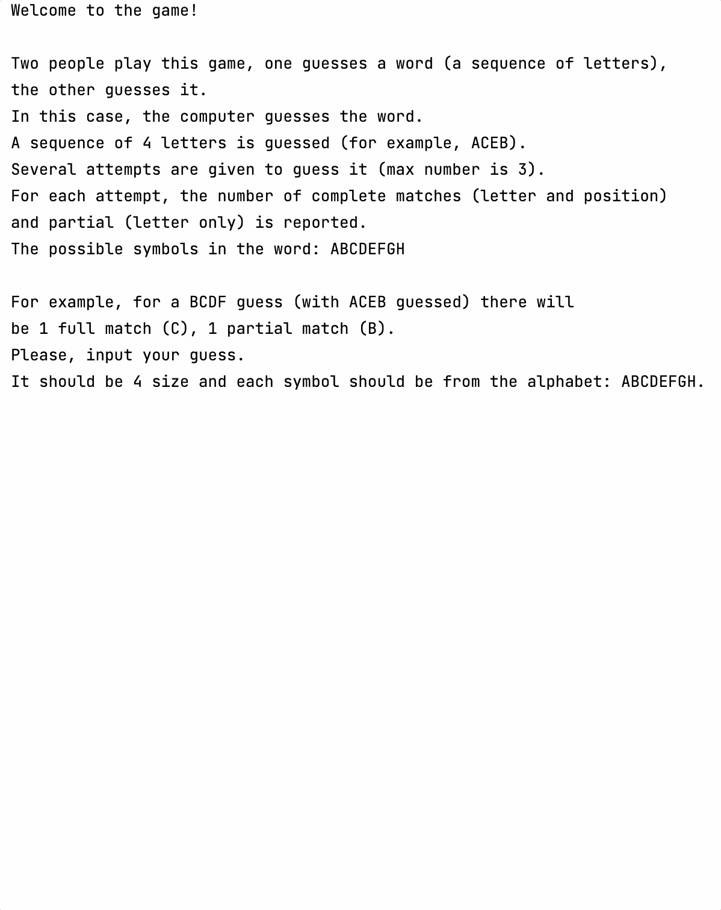

Hello! You have already learned the very basic programming constructions. 
This lesson aims to help you learn a little more complex constructions, 
such as loops, conditional statements, and more.

----

    

### The project's description

The project of this lesson is **Bulls and cows (Mastermind)**.
This is a popular children's game of guessing the hidden word.
The main goal of the game is to guess the hidden word. 
With each attempt, the player receives the number of exact and the number of partial matches that are in the original word. 
For example, for a BCDF guess (with ACEB guessed) there will be 1 full match (C), 1 partial match (B).
The detailed rules can be found [here](https://en.wikipedia.org/wiki/Bulls_and_Cows).

In this lesson, the project will be divided into two parts:
- First, you will create a game prototype that can play with the user 
but the hidden word will always be the same.
- The second step will be adding a randomly generated hidden word 
as well as the ability to safely communicate with the user: e.g., handle the user input.

### The lesson's topics

- different types of variables;
- functions;
- loops;
- ranges;
- `if` expressions;
- `or` and `and` boolean operations;
- basic facts about the List collection, built-in functions to work with it, 
basic facts about lambda expressions in these built-in functions;
- `random` function.

### The project's example

In order for the picture to fit, additional line breaks were added.
You don't need to add them when solving the task.
